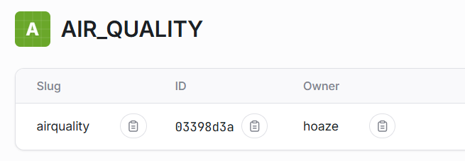
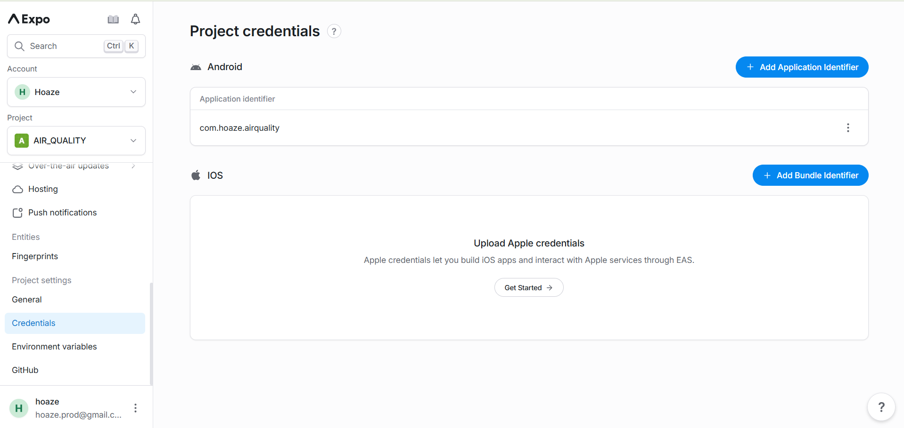
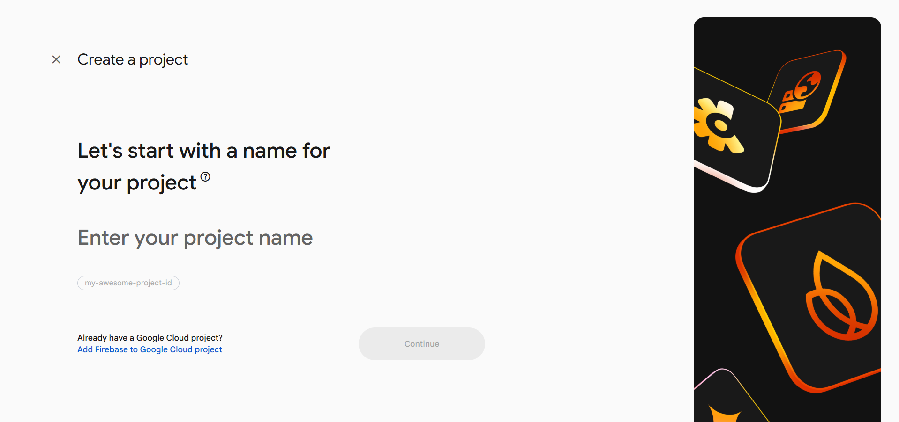
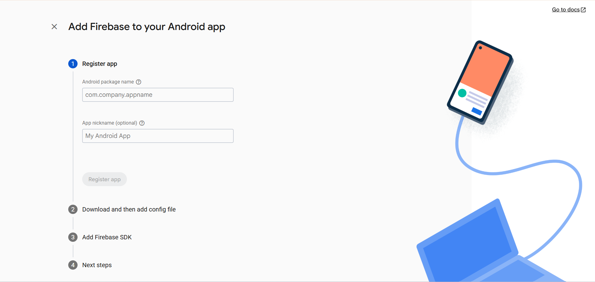
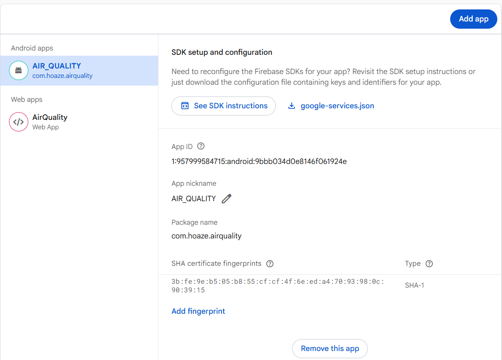
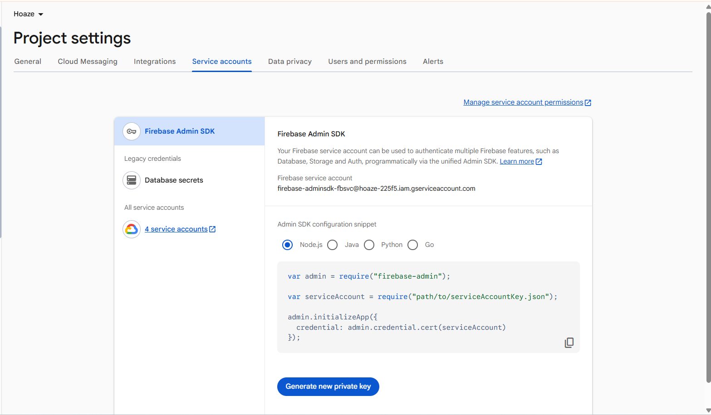
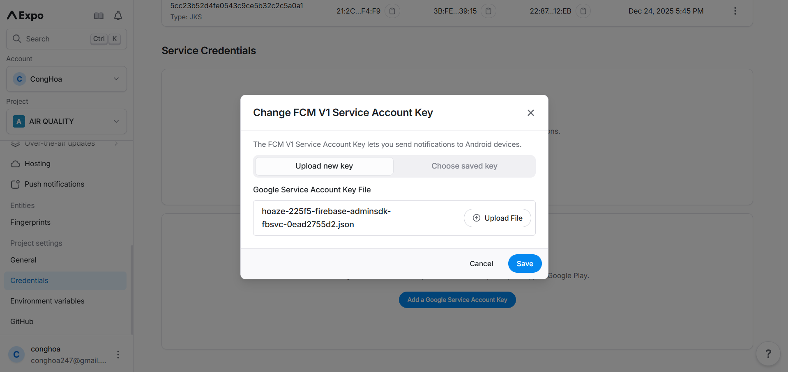
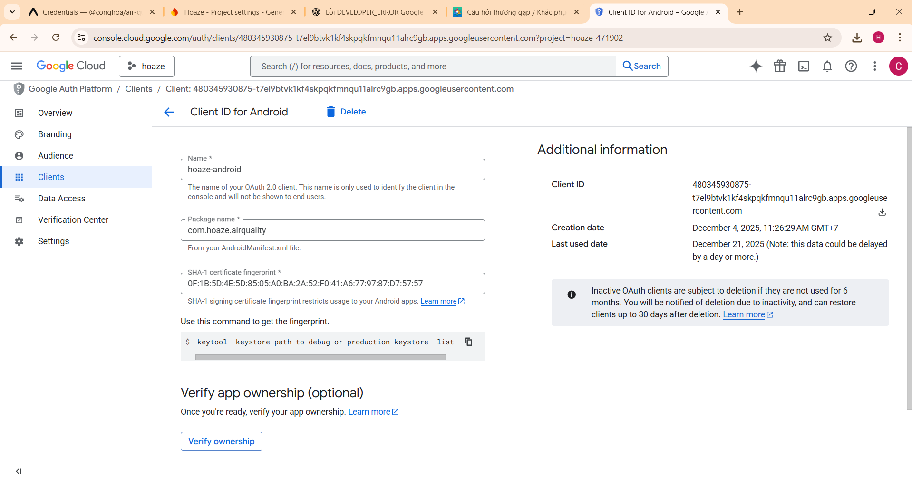
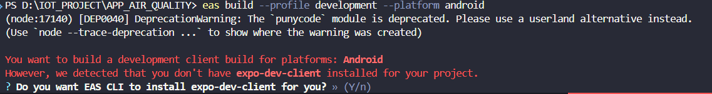
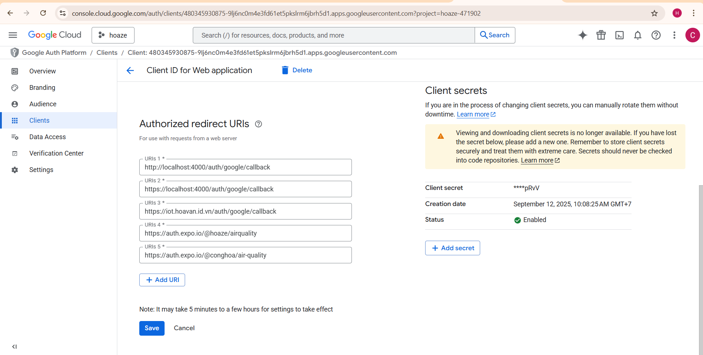

# Welcome to your Expo app 👋

This is an [Expo](https://expo.dev) project created with [`create-expo-app`](https://www.npmjs.com/package/create-expo-app).

## Create New Project

<video width="800" controls>
  <source src="./docs/create_project.mp4" type="video/mp4">
</video>

1. Run `npm install --global eas-cli`

2. Run `npx create-expo-app my-project`

3. Run `cd my-project`

4. Run `eas init --id 5c0b22e5-38d7-4211-8bf8-fd112cfcd9af`

## Change information project

1. Replace `ProjectID` and `owner` as in Expo Cloud

   ```json
   "extra": {
     "router": {},
     "eas": {
       "projectId": "03398d3a-e056-46a9-a958-2010964e616e"
     }
   },
   "owner": "hoaze"
   ```

2. Info Project in Cloud `https://expo.dev/accounts/hoaze`

   
   

### Warning

- Not change `slug`
- `"package": "com.hoaze.airquality"` là duy nhất cho mỗi project nếu thay đổi CH Play xem như là app mới và không thể cập nhật ứng dụng.

## Config .ENV

1. Create a `.env` file in the root of your project directory and add environment-specific variables on new lines in the form of `EXPO_PUBLIC_[NAME]=VALUE`

```.env
EXPO_PUBLIC_API_URL=https://api.example.com
EXPO_PUBLIC_API_URL=abcdef12345
```

2. Use `.env`

```ts
console.log(process.env.EXPO_PUBLIC_API_URL);
```

## Build project

1. Log in to your Expo account

- Login user

  ```bash
  eas login
  ```

- Check user

  ```bash
  npx expo whoami
  ```

2. Create file `eas.json` build config

   ```json
   {
     "build": {
       "development": {
         "developmentClient": true,
         "distribution": "internal",
         "android": {
           "buildType": "apk"
         }
       },
       "preview": {
         "distribution": "internal",
         "android": {
           "buildType": "apk"
         }
       },
       "production": {
         "android": {
           "buildType": "app-bundle"
         }
       }
     }
   }
   ```

3. Use this command to build an APK using the `development` profile

   - Development build (APK)

   ```bash
   eas build --profile development --platform android
   ```

   - Preview build (APK)

   ```bash
   eas build --profile preview --platform android
   ```

   - Production build (AAB)

   ```bash
   eas build --profile production --platform android
   ```

   ### Explanation:

   - -p android → Build for Android

   - --profile preview → Use the "preview" config from eas.json

   - --profile development → Use the "development" config from eas.json

   - --profile production → Use the "production" config from eas.json

4. Config app.json

- Get info project form expo cloud

```json
"expo": {
    "name": "new name",
    "slug": "new slug",
    "owner": "new owner",
    "package": "new package", // Tạo package mới luôn
    "extra": {
      "eas": {
        "projectId": "new projectId"
      }
    }
  }
```

5. Config firebase

- Create a new project



- Create a new android service with `android package name` same package name in `app.json`



- Add new `fingerprints` and download `google-services.json` to `root`folder project



- Download `Service Account` and enter Generate new private key



- Add service account to expo cloud



6. Create client WEB àn Android in Google Console 



7. Install `expo-dev-client` (If not available)

   

   - Run command line below or Enter `Y`

   ```bash
   npm install expo-dev-client
   ```

   - Build again

   ```bash
   eas build --profile development --platform android
   ```

## Build app with new user account

1. Logout user

```bash
eas logout
```

2. Login user

```bash
eas login
```

3. Check user

```bash
npx expo whoami
```

4. Change setting `app.json`

```json
{
  "expo": {
    "name": "new name",
    "slug": "new slug",
    "owner": "new owner",
    "extra": {
      "eas": {
        "projectId": "new projectId"
      }
    }
  }
}
```

5. Add new `SHA certificate fingerprints` in Firebase
 
6. Config Auth 2.0 in Google Console 




## Get started

1. Install dependencies

   ```bash
   npm install
   ```

2. Start the app

   ```bash
   npx expo start
   ```

3. Start the app with clear cache

   ```bash
   npx expo start -c
   ```

In the output, you'll find options to open the app in a

- [development build](https://docs.expo.dev/develop/development-builds/introduction/)
- [Android emulator](https://docs.expo.dev/workflow/android-studio-emulator/)
- [iOS simulator](https://docs.expo.dev/workflow/ios-simulator/)
- [Expo Go](https://expo.dev/go), a limited sandbox for trying out app development with Expo

You can start developing by editing the files inside the **app** directory. This project uses [file-based routing](https://docs.expo.dev/router/introduction).

## Get a fresh project

When you're ready, run:

```bash
npm run reset-project
```

This command will move the starter code to the **app-example** directory and create a blank **app** directory where you can start developing.

## Note on use

### 1. Cách tổ chức thư mục

| Loại          | Nhiệm vụ                    | Có hook?        | Có UI / toast / router?                               |
| ------------- | --------------------------- | --------------- | ----------------------------------------------------- |
| **Service**   | Gọi API, xử lý dữ liệu      | ❌ Không        | ❌ Không                                              |
| **Utils**     | Validate, helper            | ❌ Không        | ❌ Không                                              |
| **Hook**      | Logic phức tạp kết hợp hook | ✅ Có           | ✅ Có thể (router, context, toast)                    |
| **Component** | UI nhỏ, tái sử dụng         | ❌ / ✅ nếu cần | ✅ Không dùng router trực tiếp, có thể event callback |
| **Screen**    | Màn hình đầy đủ             | ✅ Có           | ✅ Có thể toast, router, loading                      |

### Cách dùng Expo push notification

## Learn more

To learn more about developing your project with Expo, look at the following resources:

- [Expo documentation](https://docs.expo.dev/): Learn fundamentals, or go into advanced topics with our [guides](https://docs.expo.dev/guides).
- [Learn Expo tutorial](https://docs.expo.dev/tutorial/introduction/): Follow a step-by-step tutorial where you'll create a project that runs on Android, iOS, and the web.

## Join the community

Join our community of developers creating universal apps.

- [Expo on GitHub](https://github.com/expo/expo): View our open source platform and contribute.
- [Discord community](https://chat.expo.dev): Chat with Expo users and ask questions.
