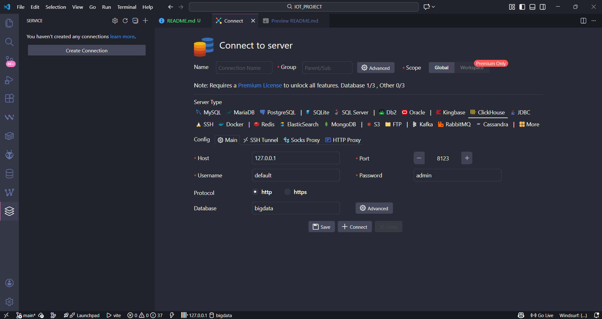

# ClickHouse Docker Compose

## 1. Giới thiệu

Docker Compose này triển khai:

* **ClickHouse**: hệ quản trị cơ sở dữ liệu OLAP

Bạn có thể chạy nhanh service trên Docker và cấu hình để truy vấn ClickHouse.

---

## 2. Yêu cầu

* Docker >= 20.x
* Docker Compose >= 1.29.x
* Network Docker tên `bigdata-network` (hoặc thay đổi theo ý bạn)

---

## 3. Cấu trúc thư mục

```
project/
│
├─ docker-compose.yml
├─ data-insert.ipynb                    # Dùng tạo dữ liệu ảo
├─ init.sql                             # Chứa các lệnh tạo khởi tạo database
├─ test-connect.py                      # Test kết nối đến ClickHouse
└─ README.md
```

---

## 4. Tạo Docker network

Nếu chưa có network:

```bash
docker network create bigdata-network
```

---

## 5. Khởi chạy Docker Compose

```bash
docker-compose up -d
```

* Chờ khoảng 10–20 giây để ClickHouse sẵn sàng.

Kiểm tra container:

```bash
docker ps
```

* Bạn sẽ thấy `clickhouse` đang chạy.

---

## 6. Truy cập ClickHouse UI

* URL ClickHouse: [http://localhost:8123](http://localhost:8123)
* Login:

  * Username: `default`
  * Password: `admin`

---

## 7. Tạo database `bigdata`

* URL ClickHouse: [http://localhost:8123/play](http://localhost:8123/play)
* Login:

  * Username: `default`
  * Password: `admin`

* Tạo database:

```bash
create database bigdata
```

---

## 8. Kết nối ClickHouse bằng VS Code


* Điền thông tin kết nối như hình và nhấn `Connect`

---

## 9. Lưu ý

* ClickHouse HTTP port 8123 → container + Grafana dùng hostname service `clickhouse:8123`
* Container khác trong cùng network vẫn giao tiếp qua port container, không cần host port.

---