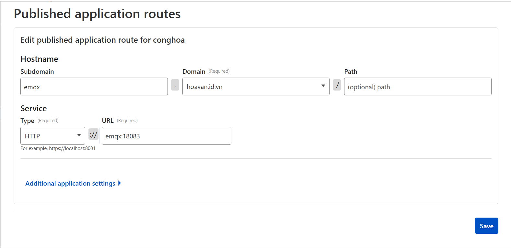

# Cloudflared Tunnel with Docker Compose

Dự án này dùng **Cloudflare Tunnel** để expose các dịch vụ nội bộ ra Internet thông qua Docker Compose.

---

## Cấu trúc thư mục

```
D:.
│   docker-compose.yml
│   README.md
```

---

## Docker Compose

```yaml
services:
  cloudflared:
    image: cloudflare/cloudflared:latest
    restart: unless-stopped
    command: tunnel --no-autoupdate run --token <YOUR_TUNNEL_TOKEN>
    networks:
      - bigdata-network

networks:
  bigdata-network:
    external: true
```

* `image`: Sử dụng image chính thức `cloudflare/cloudflared`.
* `command`: Chạy tunnel với token từ Cloudflare.
* `restart: unless-stopped`: Container tự restart nếu lỗi.
* `networks`: Kết nối container vào network Docker `bigdata-network`.

---

## Hướng dẫn triển khai

### Bước 1: Tạo network Docker (nếu chưa có)

```bash
docker network create bigdata-network
```

### Bước 2: Chạy container Cloudflared

```bash
docker-compose up -d
```

Container sẽ kết nối tới Cloudflare và expose dịch vụ nội bộ ra Internet.

### Bước 3: Kiểm tra trạng thái tunnel

```bash
docker logs -f cloudflared
```

> Bạn sẽ thấy URL công khai do Cloudflare cấp.

---

## Ví dụ tạo public hostname trên Cloudflare



* Cách đặt URL: `cloudflared:8080`
* Nếu container Kafka-UI chạy trên port 8080, URL public hostname sẽ là: `kafka-ui:8080`

## Lưu ý

* Token Cloudflare phải hợp lệ.
* Dịch vụ muốn expose phải cùng network `bigdata-network`.
* Để expose nhiều dịch vụ, cấu hình thêm `ingress` rules trong Cloudflare Dashboard hoặc dùng file config `.yaml`.
